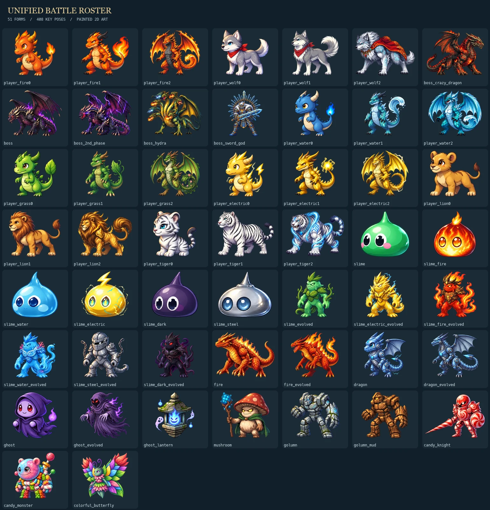

# Character Art Refinement

## Shipped Scope

- All **51 active battle forms / 408 key-pose drawings** now use the unified painted-anime art direction: 21 starter stages, 25 ordinary/evolved monster forms and five boss appearances (including Dark Dragon King's independent second phase).
- The previous fire hatchling and ghost refinements are the style masters. This batch redraws the other 49 forms with the built-in `image_gen` tool, using each existing atlas as its identity reference. These are new drawings, not CSS recolors.
- The direction unifies smooth contours, sculpted shading and controlled highlights while retaining species, evolution silhouettes, palettes and material differences. Crazy Dragon retains its right-facing source and existing runtime flip.
- All forms use the existing weight/material body-motion layer: grounded, soft, hover, wing or heavy. Only fire hatchling and ghost enable the reviewed alternate idle-expression beat; other inhale drawings are used during actions rather than forcing a visibly mismatched idle loop.
- This remains eight-key-pose **2D** animation, not 3D, skeletal articulation or generated in-between frames. Menu portraits, legacy loading fallbacks and boss-introduction portraits are unchanged. No combat, progression, audio, save or boss-introduction timing changes.



## Assets And Reproduction

- Runtime assets: `public/sprites/visual-pilot/*-refined-v2.webp`, plus `fire-hatchling-v2.webp` and `ghost-v2.webp`.
- Active file, fixed silhouette bounds and support-pivot registry: `src/data/spriteAnimationAssets.ts`.
- Full prompts, source identities, generation revisions and reviewed anchors: `scripts/unified-art-sources.json` (49 forms) and `scripts/refined-art-sources.json` (two masters).
- Output/source hashes, per-pose decoded hashes, crop bounds, scale and offsets: `public/sprites/visual-pilot/registration-unified-v2.json` and `registration-refined-v2.json`.
- Generated source PNGs remain in the local Codex generated-images directory. Every runtime deliverable is a repository WebP; the game has no dependency on that local source directory or a generation API.
- Previous atlases are retained for comparison and rollback. Offline verification covers **102 stored atlases / 816 cells**, but the active runtime registry contains exactly 51 distinct files.

The offline Pillow/NumPy pipeline preserves native alpha, removes near-transparent noise below alpha 16, and optionally normalizes near-opaque generated surface noise (threshold 250, or the reviewed 240 override for fire dragon king). Transparent edges and texture resolution are retained. The earlier magenta-matte extraction path remains available for old sources.

Every set uses one uniform scale, a registered support/hover baseline, and transparent gutters. Large crowded source layouts were regenerated rather than cutting off wings, tails or props. Manual support-foot overrides exclude tail, cape and electrical-effect pixels that otherwise make recoil slide sideways. Output encoding remains quality 80-92 with a strict 400,000-byte ceiling; rejected candidates do not overwrite an approved atlas.

```sh
python3 scripts/prepare-roster-atlases.py \
  --source-dir /path/to/generated_images \
  --manifest scripts/unified-art-sources.json \
  --registration registration-unified-v2.json \
  --preview-dir /tmp/unified-art-review

# Incremental rebuild, preserving other registered forms:
python3 scripts/prepare-roster-atlases.py \
  --source-dir /path/to/generated_images \
  --manifest scripts/unified-art-sources.json \
  --registration registration-unified-v2.json \
  --only mushroom

python3 scripts/prepare-roster-atlases.py --verify
```

## Motion And Loading

- Physical slots still own facing, attack travel, impact and duration. Co-op active-role changes never redirect an animation to the other physical actor.
- The union of all eight silhouettes is fitted once into the existing battle envelope. Pose changes do not change the outer frame, zoom or baseline. Existing boss sizing and layout constraints are retained.
- Body and pose layers pause together. Low-performance mode disables idle motion but retains short action/recoil animations. Reduced-motion rules disable both animated layers and retain static action poses.
- Selection preloads only selected characters. Battle preloads a rolling window of the active party, current enemies, next encounter and next evolution. Dark Dragon King's second phase is warmed before the HP threshold, including when it occupies the secondary enemy slot.
- Visible actors share and outrank speculative requests. At most two decode requests run concurrently; the LRU retains eight decoded image references (about 48 MiB of RGBA pixels, **not** a hard limit on all browser/GPU memory).
- Low-performance/save-data/slow-connection mode omits speculative future encounters and evolutions. Obsolete speculation is canceled, failures/timeouts leave the legacy fallback visible, and a later online event can retry. Ready images render without another loading-state swap.
- No new particles, blur layers, per-frame React state or runtime dependencies. Atlases stay 2048x768, one per actor. The active set is **15,381,246 bytes**, up **1,648,450 bytes (12.0%)** from the accepted baseline. These are on-demand assets, not a full-roster startup download.
- PWA image caching remains request-driven. Offline registration/audit JSON is excluded from service-worker precaching because gameplay does not use it. Retained old files increase repository/package size but are not requested by the active registry.

## Validation

- Final local checks passed: TypeScript, ESLint with zero warnings, all 874 tests, offline atlas verification and `git diff --check`. `build:budget` passed at 967.4 KB total JavaScript against the unchanged 976.6 KB limit. This is local validation, not a remote CI result.
- All 51 final forms decoded in a browser fixture mounting production `BattleSprite`. Every form switched through all eight positions, with a stable 200x166.66 CSS-pixel outer frame in the gallery.
- Production `BattleScreen` was sampled in solo and four-actor Co-op, including Crazy Dragon, Sword God, Hydra and independent Dragon King phase-two art. Narrow portrait and short landscape views were checked for clipping and actor/HUD occlusion.
- Requested CSS viewport checks: 390x844, 320x568, 844x390, 568x320 and 1280x720. No horizontal overflow was observed. These are emulated browser checks, not physical-phone FPS, memory or thermal measurements.
- Computed styles confirmed the secondary player's exclusive attack clip, paused body/pose layers, and low-performance idle-off/action-on behavior. Reduced-motion CSS was reviewed, not OS-preference-emulated.
- The preload tests cover all factory identities, variants, Co-op round lookahead, boss phases, constrained networks, request deduplication, queue priority, LRU eviction, cancellation, timeout, retry and malformed images.
- Temporary QA entry points are removed after verification. QA does not modify game saves or audio settings.
